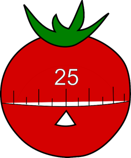

<h1 align="center">pomo</h1>
<h4 align="center">simple pomodoro timer in cli</h4>
<div align="center"></div>

---

## Table of content

- [Description](#description)
- [Setup](#setup)
- [Usage](#usage)
- [License](#license)

# Description

Pomo is a simple productivity tool written in C that helps unix users manage 
their time using the [Pomodoro Technique](https://en.wikipedia.org/wiki/Pomodoro_Technique) 
directly on the terminal.

# Setup

> You need to have gcc and make installed.

1. Clone this repo :
```bash
git clone github.com/the01rch/pomo
```
2. Go to the directory :
```bash
cd pomo
```
3. Build and install it with
```bash
sudo make install
```
4. Uninstall the program

```bash
sudo make uninstall
```

# Usage

To start the timer use the flag start :

```bash
pomo start &
```

To pause the timer use the flag pause :

```bash
pomo pause
```

To resume the timer use the flag resume:

```bash
pomo resume
```

To stop the timer use the flag stop :

```bash
pomo stop
```

To display the time left use the flag clock :

```bash
pomo clock
```

# License

[MIT](https://github.com/the01rch/pomo/blob/master/LICENSE.md)
